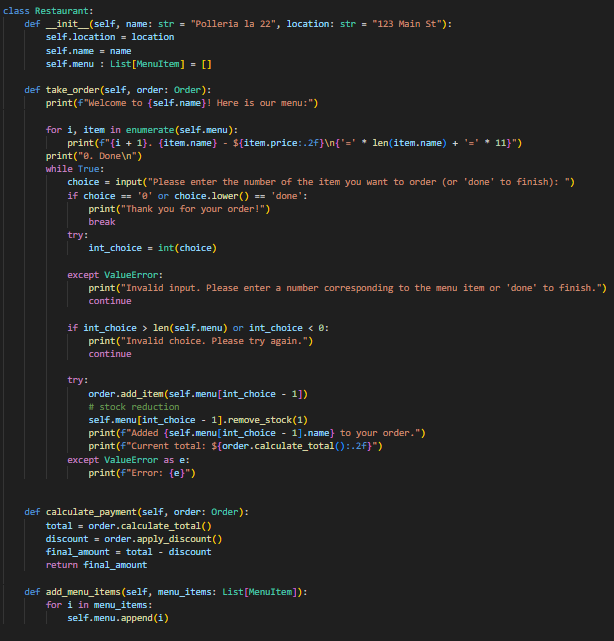
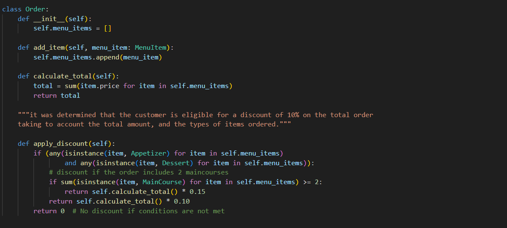
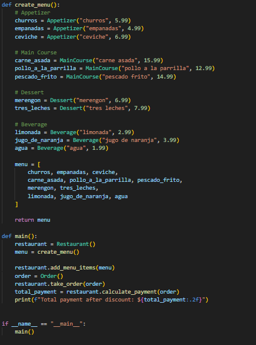

# Punto 2: Clase restaurante 🥖

> La siguiente sección hace parte de la aplicación de la programación orientada a objetos bajo un contexto de restaurante.

Se demuestran los siguientes conceptos aplicados:

- **Abstracción**: Capacidad de reducir un menú, un restaurante y una orden a una generalidad basada en sus características fundamentales.
- **Herencia**: Interacción de código entre un ítem de un menú y clasificaciones específicas (por ejemplo: `MainCourse`, `Beverage`, `Dessert`, etc.).
- **Composición**: Uso de una **Order** como parámetro/objeto que habilita funcionalidades como calcular totales, aplicar descuentos, etc.

## Tabla de contenidos_

- [Abstracción de elementos](#abstraccion-de-elementos)
  - [Clase Order](#clase-order)
- [Menú interactivo](#menu-interactivo)
- [Conclusiones](#conclusiones)
- [Referencias](#referencias)

---

## Abstraccion de elementos

Primeramente, debemos concebir un restaurante a partir de sus generalidades. Un restaurante debería tener:

- **Localización**: lugar tangible guardado como dato.
- **Nombre**: etiqueta de cada restaurante.
- **Menú**: colección de elementos a ofrecer; dato de relación entre restaurante–orden–cliente.

Por lo que se podría generar inicialmente un constructor como el siguiente:

```python
from typing import List

class Restaurant:
    def __init__(self, location: str, name: str):
        self.location = location
        self.name = name
        self.menu: List["MenuItem"] = []
```

En este caso, la clase `Restaurant` se construye basándose en un **nombre** y una **localización**. No se requiere un menú inicial para
instanciar el restaurante, ya que el menú es un atributo mutable que puede variar dependiendo de temporada, recursos, disponibilidad, etc.

Como solución para manejar un menú cambiante, se decide realizar una función llamada `add_menu_items`, donde se requiere como parámetro
una lista de elementos que conformarán el menú.

Además, se aplica un método para calcular el pago donde se requiere una `Order`, la cual tendrá los platos ordenados y validará si
cumplen o no requisitos para un descuento.



---

## clase order

De igual manera, la clase `Order` hace parte fundamental para la formación de un contexto de restaurante ideal. Por esto, se genera una
clase independiente del restaurante, que al interactuar con este permite llevar a cabo una solicitud de orden.

En términos de diseño, esto favorece la composición: el restaurante **usa** una orden para calcular y operar, pero no “es” una orden.



---

## Menu interactivo

Para simular una situación cotidiana, se genera un menú interactivo donde el usuario pide platos a partir de su número de asignación y
estos se van acumulando en la orden. Al solicitar el pago, la orden se basa en los ítems tomados por el usuario.

Puedes ver la ejecución en: [ejecutar código](Code/Reto3.py)



---

## Conclusiones

- La **abstracción** permite modelar entidades del mundo real (restaurante, menú y orden) con atributos esenciales y reglas claras.
- La **herencia** ayuda a especializar comportamientos de elementos del menú a partir de un tipo base común (por ejemplo, `MenuItem`).
- La **composición** facilita que `Restaurant` y `Order` colaboren: una orden agrupa ítems y cálculos, mientras el restaurante gestiona su
  menú y políticas (por ejemplo, descuentos).

---

## Referencias

- Aserdargun. (s. f.). *Advanced OOP in Python*. Medium. https://medium.com/@aserdargun/advanced-oop-in-python-a5f6130da291
