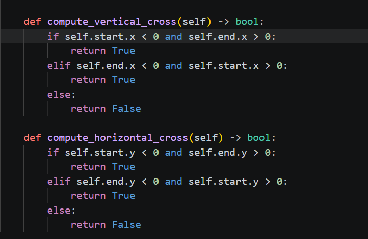

# Reto 3: Herencia vs Composición : 🧔 - > 🧑‍🦱
>El siguiente repositorio hace parte de la entrega del reto 3 donde se demuestra la utilidad de la herencia y composición en 
>contextos prácticos, uso de herencia para especificar y extender funciones y uso de objetos cómo parametros

## Tabla de contenidos ✔️
- [Parte 1: Geometrías Básicas](#geometrías-basicas-)
   - [Clase punto y Linea]()
   - [ Rectangulo y Cuadrado]()
     - [Diversidad de parametros]()
- [Parte 2: Restaurante]()
   - [Abstracción de elementos]()
   - [Clase Orden]()
   - [Menu Interactivo]()
- [Observaciones]()
- [Referencias]()
  
---

Una vez comprendido cómo funciona el paradigma orientado a objetos, se busca aplicar sus pilares fundamentales
a partir de problemas que los evidencien en contextos cotidianos.
- Inicialmente, se propone concebir geometrías simples a partir de la *Abstracción* de lineas y rectangulos en un plano cartesíano,
donde podremos obtener cualquiera de estos y relacionarlos entre ellos.
- Más adelante, se aplicarán los pilares a partir de un contexto de restaurante cotidiano, donde deberemos tomar una orden a partir 
de un menu, y socializar un costo.

Evidenciamos a partir de estos el uso de la **Abstracción** cómo medida para transformar elementos de la vida real en objetos
códificables por la computadora; de la **Herencia** y **Composición** en la generación de clases y métodos que pertenezcan y se
relacionen entre *superclases*

---

## Geometrías Basicas 📐 
  A partir de este ejercicio se busca formular una clase Rectangulo, capaz de inicializarse a partir de diferentes métodos;
  generar una subclase cuadrado y evaluar si un punto dado se encuentra en el interior o no de estos

### Formación plano cartesiano: 📋

Para formar cualquier geometría debemos partir de alguna referencia, un "campo de juego" donde podramos generar y manipularlas bajo diferentes parametros.

Cómo objeto que nos capacitará para poder crear cualquier geometría, se genero la clase **Point** con las coordenadas (x,y) cómo atributos asignables,
permitiendo asi *abstraer* un plano cartesiano al colocar cualquier numero real cómo parametro de estos.

```python

class Point:
   def __init__(self, x:float, y:float):
         self.x = X
         self.y = y
```

Cualquier instanciación de un punto tomara unas coordenadas en las cuales esté se encontrara, de forma que a partir de varios puntos tomamos parametros para formar una geometría.

---

### Clase Linea 📏

Inicialmente, a partir de dos puntos podemos formar una linea unica cuyos extremos son estos puntos,  
cuyas características son las siguientes:

| Linea    | Características |
| -------- | --------------- |
| Pendiente | $m = \frac{y_2-y_1}{x_2-x_1}$ |
| Longitud | $\mathbf{L} = \sqrt{(x_2-x_1)^2+(y_2-y_1)^2}$ |

Por lo que la inicialización de cuaquier linea se realiza de la siguiente forma: 

```python
Class Line:
   def __init__(self, start:Point, end:Point):
      self.start = start
      self.end = end
      self.length = self.compute_length(start, end)
      slef.slope = self.compute_slope(start, end)
```
Demostrando la Composición de los objetos *Point* usados cómo parametros para la formación de la clase **Line**
Además observamos la formación de atributos directamente a partir de métodos inicializados en la instanciación

```python
 def compute_length(self, start: Point, end: Point) -> float:
        length = ((end.x - start.x)**2 + (end.y - start.y)**2)**0.5
        return length

    def compute_slope(self, start: Point, end: Point) -> float:
        if end.x - start.x == 0:
            raise ValueError("La pendiente es indefinida para líneas verticales.")
        slope = (end.y - start.y) / (end.x - start.x)
        return slope
```

se logra observar la conversión de las formulas matemáticas usadas cómo algoritmos para formar un nuevo valor, y se desarrollaron dós metódos más para validad si la linea 
cruza por el eje x y por el eje y del plano



Para validar si la linea interseca sobre los ejes, evaluamos si los puntos de inicio y fin se encuentran en cuadrantes opuestos, donde por lo tanto cruzara sobre el eje definido

---

### CUadrados Y Rectangulos

**U**na vez habituados a la formación de objetos a partir de otros objetos, formaremos geometrías más avanzadas cómo rectangulos y cuadrados,
sin embargo con una complejidad

- Uso de parametros dinámicos: En tóda función que requiere diferentes variables de entrada, se definen paraetros obligatorios que deben añadirse para ejecutar la función,
  Sin embargo existe la posibilidad de realizar diferentes procedimientos a partir de los parametros que se nos proveen.
  
En este caso los parametros pasan de ser fijos obligatorios, a ser **Dinamicos** y determinantes para elegir que procedimiento realizar.
Cómo estrategía para resolver está oportunidad, se desarrollo el siguiente código: 


### Analisis de código 🧐❓

| Valores | Uso |
|---------|-----|
|```*```  | agrupador de argumentos, busca realizar una tupla o un dict con los elementos en un orden|
|```isinstance(p,Class) for p in ...``` | valida si existe una instancia específica y recorre una tupla validando cada iteración |
| ```all()``` | Operador lógico que controla si todos los objetos de una tupla cumplen alguna condición |
|```.issubset(kwargs.key())``` | controla si un subconjunto o lista hace parte de otro conjunto |
|```# type: ignore ```| comentario especial que omite la validación de verificadores de tipos, evitando que los tipos se encuentren inicializados primeramente |

El Código forma la plantilla para generar un rectangulo basandose en un numero variable de parametros con un orden definido, en este caso:

- Inicialización de un cuadrado a partir de sus puntos extremos, requiere de la clase *Point*
- A partir de su punto más inferior junto con su ancho y altura
- Iniciar a partir de su punto central, su ancho y su alto

A partir de estás necesidades, se realizarón diversas estrategias para decidir cómo ejecutar procesos diferentes seguno los parametros que se nos provean.

   - **1**: Sabiendose que la cantidad de parametros variará, primero debemos agrupar los parametros de forma que tengamos una referencia para su posterior evaluación
     - En este caso se hizo uso del ` *args, **kwargs `, donde args, kwargs serán las variables para ordenar los parametros y * será un agrupador por tuplas de estós,
           kwargs utilizar ** debido a que buscamos empaquetar una relación clave : valor, por lo que requiere dos agrupaciones

     - :warning: **Precaución**, al llamar la función, no se podrán utilizar ambos tipos de argumentos debido a que será confuso mezclar posiciones y llaves
            `Rectangle(punto1, center=punto, width5)` :heavy_multiplication_x:
   - **2**: Una vez empaquetados los parametros, debemos detectar qué tipo de inicialización surgió, esto se realiza a partir de controladores `if-else` que validan si una lista o posición          posee un tipo específico, de forma que caracteriza cuál llamada será con respecto a los tipos de los parametros llamados
      - Uso de `isinstance(p,Point) for p in args` donde una vez empaquetados los parametros en tuplas, recorre cada posción validando si cada uno *es instancia* de la clase Point
      - Uso de `{"center", "width", "height"}.ìssubset(kwargs.key()` donde a partir de las claves del diccionario kwargs, valida si TODOS los parametros propuestos se encuentran en las claves          de kwargs

   En este caso se valida en un principio si es una tupla *args con diferentes condiciones posicionales, y si es un dictionario **kwargs con las claves requeridas. Una vez identificados sus        parametros, se redireccionarán a diferentes métodos de inicialización
   


