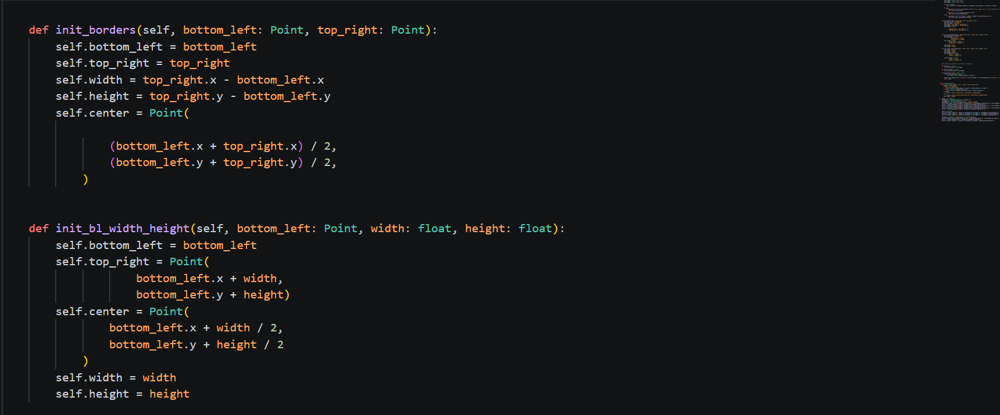
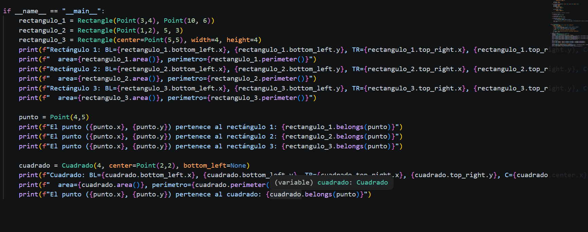

# Reto 3: Herencia vs. Composición: 🧔 -> 🧑‍🦱

> El siguiente repositorio hace parte de la entrega del Reto 3, donde se demuestra la utilidad de la herencia y la composición en
> contextos prácticos: uso de herencia para especificar y extender funciones, y uso de objetos como parámetros.

## Tabla de contenidos ✔️

- [Parte 1: Geometrías básicas](#geometrias-basicas)
  - [Formación del plano cartesiano (clase Point)](#formacion-del-plano-cartesiano-clase-point)
  - [Clase Line](#clase-line)
  - [Cuadrados y rectángulos](#cuadrados-y-rectangulos)
    - [Análisis de código (parámetros dinámicos)](#analisis-de-codigo-parametros-dinamicos)
    - [Métodos de inicialización](#metodos-de-inicializacion)
    - [Caso: inicialización por líneas](#caso-inicializacion-por-lineas)
    - [Prueba piloto](#prueba-piloto)
- [Parte 2: Restaurante](parte_2.md)
  - [Abstracción de elementos](parte_2.md#abstraccion-de-elementos)
  - [Clase Order](parte_2.md#clase-order)
  - [Menú interactivo](parte_2.md#menu-interactivo)


---

Una vez comprendido cómo funciona el paradigma orientado a objetos, se busca aplicar sus pilares fundamentales a partir de problemas que
los evidencien en contextos cotidianos.

- Inicialmente, se propone concebir geometrías simples a partir de la *abstracción* de líneas y rectángulos en un plano cartesiano,
  donde podremos obtener cualquiera de estos y relacionarlos entre ellos.
- Más adelante, se aplicarán los pilares a partir de un contexto de restaurante cotidiano, donde deberemos tomar una orden a partir
  de un menú y calcular un costo.

Evidenciamos a partir de estos el uso de la **abstracción** como medida para transformar elementos de la vida real en objetos
codificables por la computadora; y el uso de **herencia** y **composición** en la generación de clases y métodos que pertenezcan y se
relacionen entre *superclases*.

---

## Geometrias basicas

A partir de este ejercicio se busca formular una clase `Rectangle`, capaz de inicializarse a partir de diferentes métodos;
generar una subclase `Square` y evaluar si un punto dado se encuentra en el interior o no de estos.

### Formacion del plano cartesiano (clase Point)

Para formar cualquier geometría debemos partir de alguna referencia: un “campo de juego” donde podamos generarlas y manipularlas bajo
diferentes parámetros.

Como objeto que nos capacitará para poder crear cualquier geometría, se generó la clase **Point** con las coordenadas `(x, y)` como
atributos asignables, permitiendo así *abstraer* un plano cartesiano al colocar cualquier número real como parámetro.

```python
class Point:
    def __init__(self, x: float, y: float):
        self.x = x
        self.y = y
```

Cualquier instanciación de un punto tomará unas coordenadas en las cuales este se encontrará, de forma que a partir de varios puntos
tomamos parámetros para formar una geometría.

---

### Clase Line

Inicialmente, a partir de dos puntos podemos formar una línea única cuyos extremos son estos puntos, cuyas características son:

| Línea     | Características |
|----------|------------------|
| Pendiente | $m = \frac{y_2-y_1}{x_2-x_1}$ |
| Longitud  | $\mathbf{L} = \sqrt{(x_2-x_1)^2+(y_2-y_1)^2}$ |

Por lo que la inicialización de cualquier línea se realiza de la siguiente forma:

```python
class Line:
    def __init__(self, start: Point, end: Point):
        self.start = start
        self.end = end
        self.length = self.compute_length(start, end)
        self.slope = self.compute_slope(start, end)
```

Demostrando la composición de los objetos `Point` usados como parámetros para la formación de la clase **Line**.
Además observamos la formación de atributos directamente a partir de métodos invocados en la instanciación.

```python
def compute_length(self, start: Point, end: Point) -> float:
    length = ((end.x - start.x) ** 2 + (end.y - start.y) ** 2) ** 0.5
    return length

def compute_slope(self, start: Point, end: Point) -> float:
    if end.x - start.x == 0:
        raise ValueError("La pendiente es indefinida para líneas verticales.")
    slope = (end.y - start.y) / (end.x - start.x)
    return slope
```

Se logra observar la conversión de las fórmulas matemáticas usadas como algoritmos para formar un nuevo valor. Además, se desarrollaron
dos métodos más para validar si la línea cruza por el eje X y por el eje Y del plano.


Para validar si la línea interseca sobre los ejes, evaluamos si los puntos de inicio y fin se encuentran en cuadrantes opuestos; por lo
tanto cruzará sobre el eje definido.

---

### Cuadrados y rectangulos

Una vez habituados a la formación de objetos a partir de otros objetos, formaremos geometrías más avanzadas como rectángulos y cuadrados,
sin embargo con una complejidad:

- **Uso de parámetros dinámicos**: en toda función que requiere diferentes variables de entrada, se definen parámetros obligatorios.
  Sin embargo, existe la posibilidad de realizar diferentes procedimientos a partir de los parámetros que se nos proveen.

En este caso, los parámetros pasan de ser fijos obligatorios a ser **dinámicos** y determinantes para elegir qué procedimiento realizar.
Como estrategia para resolver esta oportunidad, se desarrolló el siguiente código:


#### Analisis de codigo (parametros dinamicos)

| Valores | Uso |
|--------|-----|
| `*`  | Agrupador de argumentos: permite construir una tupla con argumentos posicionales. |
| `**` | Agrupador para argumentos nombrados: permite construir un diccionario `clave: valor`. |
| `isinstance(p, Class) for p in ...` | Recorre una tupla validando si cada elemento es instancia de una clase. |
| `all()` | Operador lógico que valida si todas las condiciones en un iterable se cumplen. |
| `.issubset(kwargs.keys())` | Valida si un conjunto de claves está contenido dentro de las claves de `kwargs`. |
| `# type: ignore` | Comentario para omitir validación de tipos en chequeadores estáticos (p. ej. mypy). |

El código forma la plantilla para generar un rectángulo basándose en un número variable de parámetros con un orden definido, en este caso:

- Inicialización de un cuadrado a partir de sus puntos extremos (requiere objetos `Point`).
- Inicialización a partir de su punto más inferior junto con su ancho y altura.
- Inicialización a partir de su punto central, su ancho y su alto.

A partir de estas necesidades, se realizaron diversas estrategias para decidir cómo ejecutar procesos diferentes según los parámetros que
se provean.

1. Como la cantidad de parámetros variará, primero debemos agruparlos para tener una referencia para su posterior evaluación.
   - Se hace uso de `*args, **kwargs`.
   - **Precaución**: al llamar la función, evita mezclar posicionales y nombrados de forma ambigua.
     - Ejemplo incorrecto: `Rectangle(punto1, center=punto, width=5)`

2. Una vez empaquetados, detectamos qué tipo de inicialización surgió usando controladores `if/elif/else`:
   - `isinstance(p, Point) for p in args`
   - `{"center", "width", "height"}.issubset(kwargs.keys())`

En este caso se valida si se trata de una tupla `args` con condiciones posicionales o un diccionario `kwargs` con las claves requeridas.
Una vez identificados sus parámetros, se redirige a diferentes métodos de inicialización.

---

#### Metodos de inicializacion



Con respecto a los tipos de parámetros y su cantidad, se ejecutará uno de los métodos.

---

#### Caso: inicializacion por lineas

Como requerimiento más complejo, se solicita un método de inicialización de la clase rectángulo a partir de objetos `Line` que lo conformen.
Se observa la aplicación directa de la composición: un rectángulo se compone de líneas compuestas por

---

#### Prueba piloto

Una vez realizada la plantilla de los objetos, se realizan las funciones requeridas a partir de métodos construidos en cada constructor.




